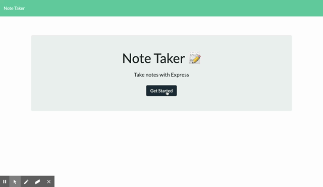

# Note Taker

## Table of Contents
* [Author(s)](#author(s))
* [Description](#description)
* [Installation](#installation)
* [Usage](#usage)
* [Contributing](#contributing)
* [Deployment Application Link](#deployment-application-link)

## Author(s)
Joey Bruno

## Description
This is a Note Taker Application for you to keep track of important things you want to remember later on a local server.

## Installation
To install this application you clone the SSH Key from the main hub page of this repository and you paste that clone link into your Terminal with git clone.

## Usage
To use this application you type 'npm start' into your own Terminal. The local server will now be listening for you to use the application. Then, go to the local host server number provided in the code.

## Contributing
To contribute, clone this repository into your terminal, work on the project, then create a pull request.

## Deployment Application Link
[Deployed Note Taker Link](https://afternoon-tor-09367.herokuapp.com/)

## Application in Use
